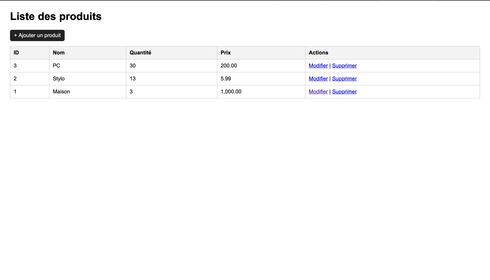
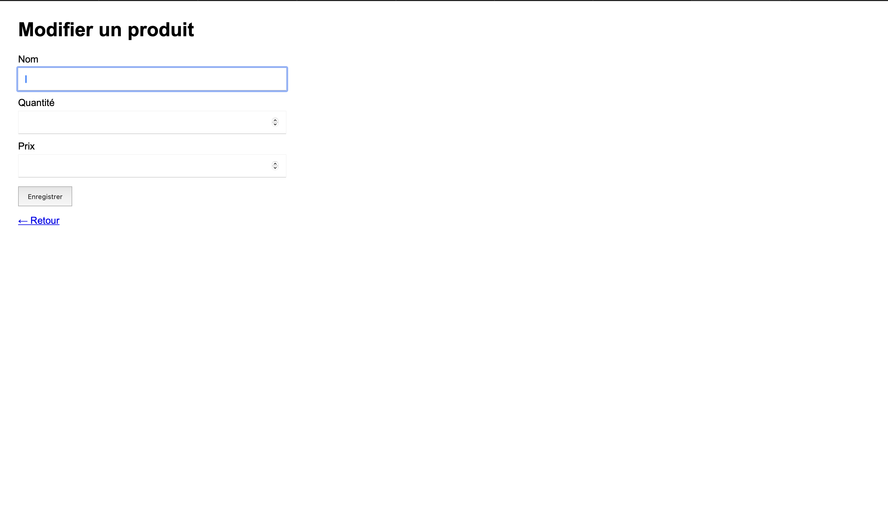

# CRUD Produits – PHP & MySQL

## Description
Application web CRUD simple en PHP et MySQL (niveau étudiant).
Permet d’ajouter, modifier, supprimer et afficher des produits.

## Fonctionnalités
- Liste des produits (READ)
- Ajouter un produit (CREATE)
- Modifier un produit (UPDATE)
- Supprimer un produit (DELETE)

## Technologies
- PHP
- MySQL (phpMyAdmin)
- XAMPP

## Installation (local)
1. Copier le dossier du projet dans `htdocs` :
   `/Applications/XAMPP/htdocs/CRUD-PHP-MySQL`
2. Démarrer Apache + MySQL dans XAMPP
3. Importer le script `sql/script.sql` dans phpMyAdmin
4. Ouvrir :
   `http://localhost/CRUD-PHP-MySQL`

## Captures d’écran

